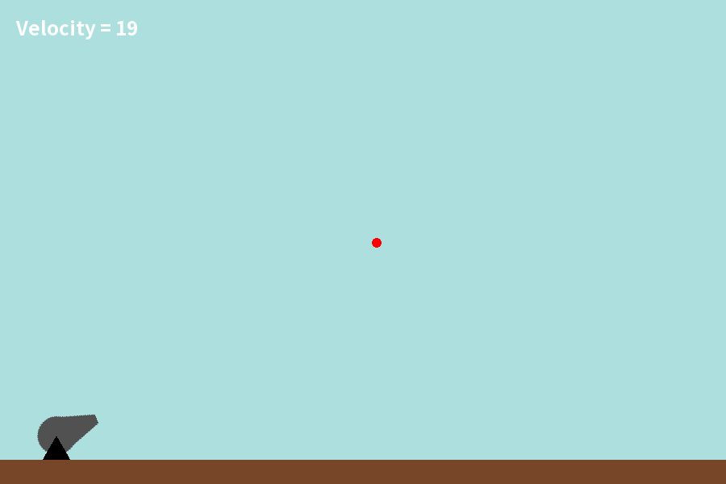

# Projectile Launch
Simulating projectile launch with C++ and SFML

|  |  |
| --- | --- |
| Name | Projectile Launch |
| Made in | May 2022 |
| Language used | C++ |
| Libraries used | SFML, string, cmath |
| Programs used | VSCode, GIMP |

## How to use
This program was compiled on Pop!-OS 22.04, using `gcc`. You may have to recompile it in order to run the program. If that is the case, you must need the `SFML` library installed.

To shoot a projectile, point at some location with your mouse, and then press any mouse button.

To increase the launch speed, press `W`. To decrease it, press `S`

You can see the current launch speed on the top left corner.

---

All code and midia was made by me.
